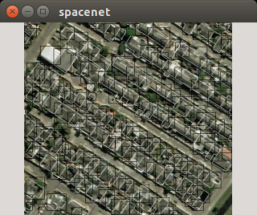

# Data Prep Steps
## Getting the data

Steps to get the dataset are available [here](https://aws.amazon.com/public-data-sets/spacenet/)

You can also use the bash script `get_data <data-dir>` to get the entire data from aws and place it in `data_dir`

## Test to see if you are able to read the geojson files 

`
cd spacement/utilities/python/
`
`
./read3band.py
`

The response should be `251994`

## Test to see if the bounding boxes are being generated correctly.
`cd spacement/utilities/python/`

`overlay.py`

You should see the image below. The white boxes represent the contours and the black boxes 
represent the bounding boxes. 
The black bounding boxes are used for training. 

## Generate the Pascal VOC-Compatible Annotation File

This script will read all the images and the corresponding annotations and generate an Pascal VOC-compatible annotation file.

`gen-pascalvoc-format.py`

## Create the Training/Test split

From caffe root, `cd data/spacenet`

Execute the script, `create-train-val.py`

At the end of the execution, we produce `trainval.txt` and `test.txt`.

## Create the test and train LMDB files
From caffe root, `cd data/spacenet`.

Execute the script, `create_data.sh`.

## One Last Check
From caffe root, 

`cd data/spacenet`

Check that the file `labelmap_spacenet.prototxt` has just two labels, building and background as shown below.

~~~~
item {
  name: "none_of_the_above"
  label: 0
  display_name: "background"
}
item {
  name: "building"
  label: 1
  display_name: "building"
}
~~~~
